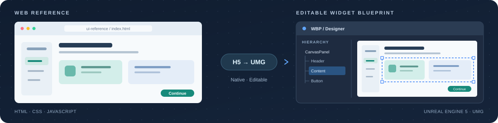

<h1 align="center">H5 → UE5 WBP</h1>

<p align="center">
  <strong>把 Web 界面，还原成原生、可编辑的 Unreal UI。</strong><br>
  <sub>面向 Codex 的 H5 → UMG 工作流 · 布局 · 交互 · 视觉细节</sub>
</p>

<p align="center">
  <a href="README.md"></a>
  &nbsp;
  <a href="README.en.md"></a>
</p>

<p align="center">
  <a href="#快速开始">快速开始</a> &nbsp;·&nbsp;
  <a href="#适用场景">适用场景</a> &nbsp;·&nbsp;
  <a href="#使用示例">使用示例</a> &nbsp;·&nbsp;
  <a href="#文件结构">参考文档</a>
</p>

<p align="center">
  
</p>

## 快速开始

在 Codex 中输入：

```text
请使用 $skill-installer 从 https://github.com/shimimokun-ai/h5-to-ue5-wbp 安装 Skill。
仓库中的路径：skills/h5-to-ue5-wbp
```

<details>
<summary><strong>手动安装与更新</strong></summary>

下载或克隆本仓库，将 `skills/h5-to-ue5-wbp` 整个文件夹复制到 Codex 的 skills 目录。

- 默认位置：`~/.codex/skills/h5-to-ue5-wbp`
- Windows 默认位置：`%USERPROFILE%\.codex\skills\h5-to-ue5-wbp`
- 如果设置了 `CODEX_HOME`：使用该目录下的 `skills/h5-to-ue5-wbp`

保留 `agents` 和 `references` 子目录。若目标位置已经存在同名 Skill，请先检查本地修改，再决定是否更新。

</details>

## 适用场景

| 可编辑的布局 | 原生的交互 | 可核查的结果 |
| :--- | :--- | :--- |
| 根据 HTML / CSS / JavaScript 参考还原 UMG，保留 WBP Designer 中可调整的布局与样式。 | 接入已有 C++、Blueprint 或 TS/PuerTS 逻辑，保留真实数据、输入和页面行为。 | 分别报告源码、编译、资源保存、运行时检查与用户视觉验收。 |

也适用于已有 UMG 界面的视觉对齐：圆角、透明边缘、模糊、滚动、DPI 和动画问题，都有对应的参考指引。

## 使用示例

安装后，在目标 UE 项目中向 Codex 提供 H5 源码位置、目标界面入口和验证要求。例如：

```text
使用 $h5-to-ue5-wbp，把 docs/ui-reference 中的 H5 界面还原为
可编辑的原生 UE5 Widget Blueprint。先检查现有界面入口和数据流，
保留项目现有业务逻辑，说明布局和样式可以在哪里调整。
```

只做评估时：

```text
使用 $h5-to-ue5-wbp，只读检查这份 H5 和当前 UE 界面，
分析转换方案、工作量和限制，先不要修改代码或资源。
```

如果运行时验收由你负责，可以明确补充：

```text
这次只做源码、构建和资源检查，不启动 PIE，也不截图。
请分别报告已验证的内容和仍需我验收的内容。
```

## 文件结构

```text
skills/h5-to-ue5-wbp/
├── SKILL.md
├── agents/
│   └── openai.yaml
└── references/
    ├── h5-umg-mapping.md
    ├── umg-visual-pitfalls.md
    └── validation-and-delivery.md
```

- [SKILL.md](skills/h5-to-ue5-wbp/SKILL.md)：适用范围、主要流程和交付要求。
- [H5 / UMG 映射](skills/h5-to-ue5-wbp/references/h5-umg-mapping.md)：布局、架构、资源和项目接入。
- [UMG 视觉问题](skills/h5-to-ue5-wbp/references/umg-visual-pitfalls.md)：圆角、透明、模糊、滚动和动画等细节。
- [验证与交付](skills/h5-to-ue5-wbp/references/validation-and-delivery.md)：验证层级、运行时检查和准确提交。

## 环境与验证边界

这是提供给 Codex 的工作流程与参考资料，不是 Unreal Engine 插件或无需项目适配的一键转换器。默认使用原生 UMG，只有明确要求时才考虑 Web Browser 嵌入。顶部配图是流程示意。

实际转换需要可访问的 H5 源码、目标 Unreal 项目以及与任务相符的编辑和构建能力。应以目标项目使用的 UE 版本和工作流程为准。

本仓库发布的是 Skill 指令和参考文档，不包含示例 Unreal 工程或运行时插件。Skill 格式检查与安装成功，不代表任何具体界面已经完成转换或通过视觉验收。
